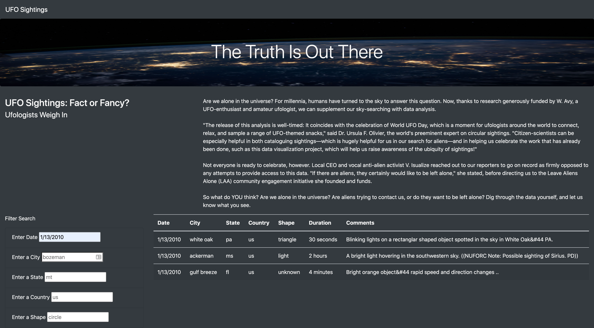
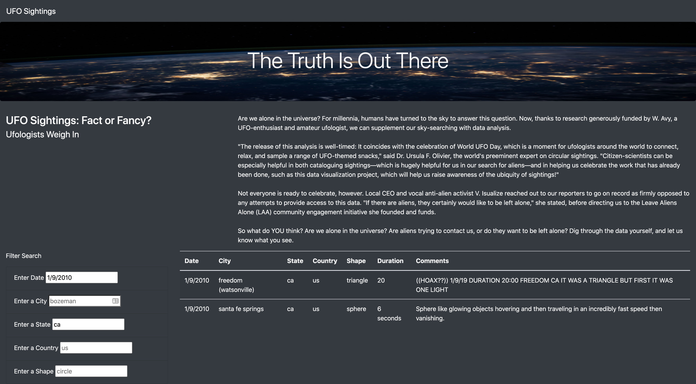
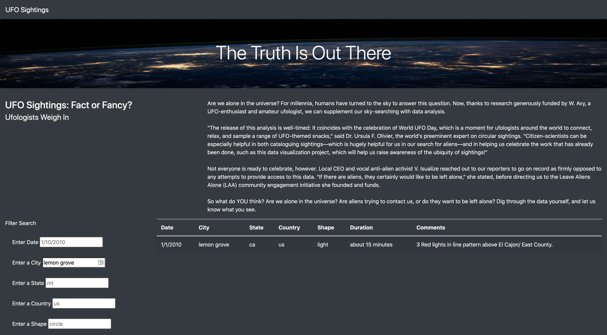

# UFOs

## Overview
The goal of this project was to build a website which allows users to filter a table of UFO sighting data by date, city, state, country, or shape. The website was built with HTML with CSS and Bootstrap included for styling. The UFO sighting data is stored in a JavaScript Object and displayed in a table, and JavaScript functions were built to handle the filtering of the data.

### Resources
#### Software: HTML, JavaScript, Bootstrap, D3, CSS
#### Data: [static/js/data.js](static/js/data.js)

## Results

#### Website Viewable Here: [UFO Sightings](https://jennadodge.github.io/UFOs/)

#### When the webpage first loads, all of the data is displayed.


To filter the results by date, city, state, country, or UFO shape, simply enter a value into the corresponding field under "Filter Search" to the left of the data table.

Below is an example of filtering for UFO Sightings on 1/13/2010.


### Resetting the Filter
To reset the filter so all of the data is showing, click "UFO Sightings" in the menu bar at the top of the page. 

### Searching by Multiple Criteria
The data can be filtered by multiple critera by simply entering a value in the appropriate filter fields. Below is an example of filtering by the date by two criteria.
- Date: 1/9/2010
- State: ca



## Summary

### Formatting Errors When Filtering
One major drawback of this filter is that the value entered into the search filter input must exactly match the [dataset](static/js/data.js).

For example, below is the result when filtering by city "lemon grove". The search correctly displays one result.


However, below is the result when filtering by city "Lemon Grove". There are no search results, because all of the data in the dataset is stored as lowercase values, and the filtering function used is looking for an exact match.


### Functions Used To Filter The Table

```js
// 1. Create a variable to keep track of all the filters as an object.
var filters = {};

// 3. Use this function to update the filters. 
function updateFilters() {

    // 4a. Save the element that was changed as a variable.
    let changedElement = d3.select(this);
    // 4b. Save the value that was changed as a variable.
    let elementValue = changedElement.property("value");
    console.log(elementValue);
    // 4c. Save the id of the filter that was changed as a variable.
    let filterID = d3.select(this).attr('id');
  
    // 5. If a filter value was entered then add that filterId and value
    // to the filters list. Otherwise, clear that filter from the filters object.
    if (elementValue) {
      filters[filterID] = elementValue;
    } 
    else {
      delete filters[filterID];
    }
  
    // 6. Call function to apply all filters and rebuild the table
    filterTable();
  }
 // 7. Use this function to filter the table when data is entered.
  function filterTable() {
  
    // 8. Set the filtered data to the tableData.
    let filteredData = tableData;
  
    // 9. Loop through all of the filters and keep any data that
    // matches the filter values
    filterKeyValues = Object.keys(filters);

    filterKeyValues.forEach((key) => {
      let filterKey = key;
      let filterValue = filters[key];

      filteredData = filteredData.filter(row => row[filterKey] === filterValue);
      
    })
  
    // 10. Finally, rebuild the table using the filtered data
    buildTable(filteredData)
  }
  ```

Note that this line requires an exact match, including the case of the input.
```js
filteredData = filteredData.filter(row => row[filterKey] === filterValue);
```
### Recommendations For Further Development 
1. Make the code more robust so user input does not have to match exactly. One simple fix to correct the issue of the input needing to be in lower case to match the dataset is to modify the code from ```let elementValue = changedElement.property("value");``` to ```let elementValue = changedElement.property("value").toLowerCase();``` to be able to use input that is capitalized.
2. Another recommendation would be to allow the user to input by partial match (e.g. - entering "lem" in the city field should return results for "lemon grove" but it returns no value).
3. Lastly, once the above has been included, I would add functionality to search for multiple dates (or a date range), or multiple cities, states, countries, or shapes at one time. 
